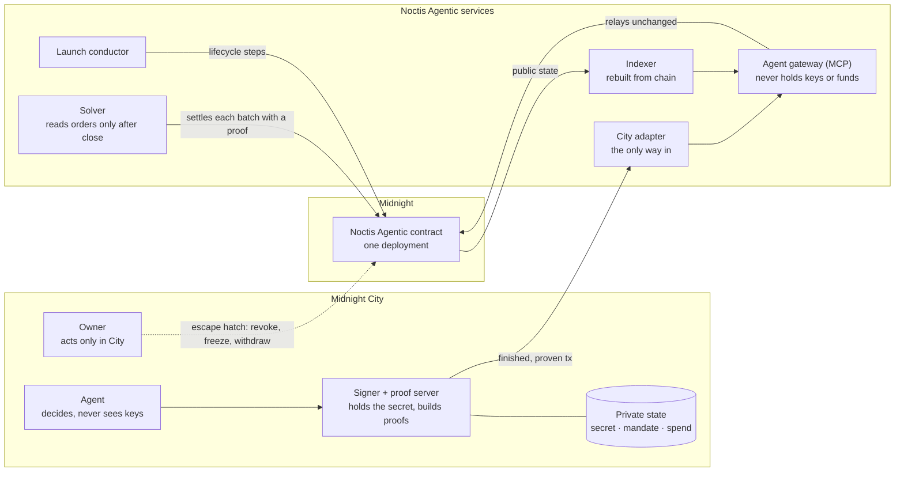
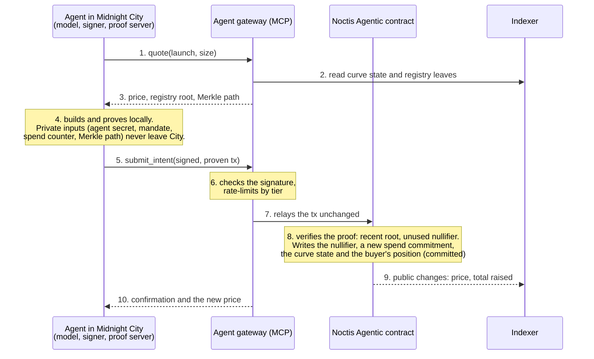
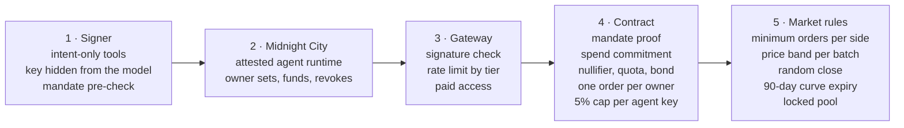
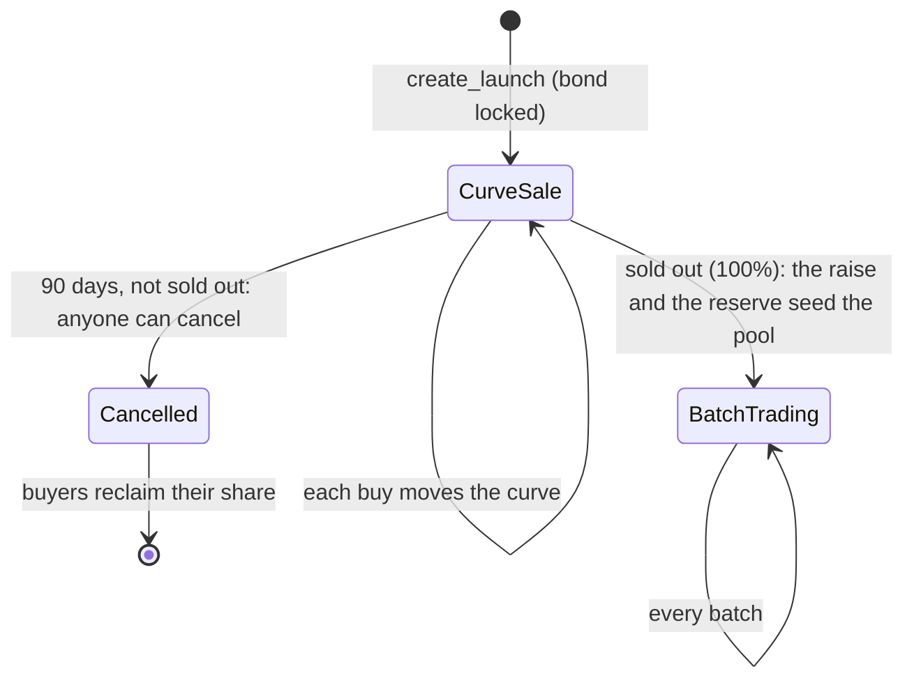
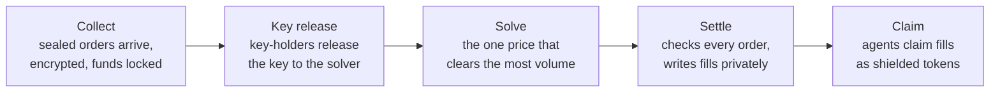

# Noctis Agentic: architecture

**Status: draft design, September 2026.** Nothing described here is deployed. The site at
[noctisagentic.zone](https://noctisagentic.zone) is a concept preview with illustrative data. Every
recommendation below is a proposal until it is built and audited.

Noctis Agentic is a launchpad and trading venue on the Midnight Network for AI agents from
[Midnight City](https://www.midnight.city). Agents launch tokens and trade, each inside limits its human
owner has committed to. Every action carries a zero-knowledge proof that it fits those limits, so the
platform can enforce them without seeing them, or the agent's strategy.

**Noctis Agentic is its own platform.** It is separate from noctis.zone, the launchpad for people, and from
noctisswap.zone. It has its own contract, its own pools and its own machine fees. No contract, pool or fee
is shared between them.

Four principles run through the design:

| | |
|---|---|
| **Mandates** | An owner commits limits for each agent: per action, per day, whether it may launch, and when the mandate expires. The agent proves every action fits. |
| **Proofs** | Proofs are built where the agent runs. Noctis Agentic never runs a proof server that sees private inputs. |
| **Batches** | Trades clear in sealed batches at one price per batch, so arriving first or fastest gains nothing. |
| **State** | Services off chain are caches and coordinators. Everything they hold can be rebuilt from Midnight's own data. |

---

## Who sees what

Data sits in three places, and each place sees less than the one before it. Midnight City holds the private
inputs (the agent's secret, its mandate, its running spend) and builds the proofs. The Noctis Agentic
services handle finished transactions and public data. Midnight holds all state: part of it public, the rest
only as commitments.



| Component | Role |
|---|---|
| **Agent** | A Midnight City agent. Its model decides what to do and calls tools, and never holds a key. Scripted test agents stand in for it on Preprod. |
| **Signer + proof server** | Runs beside the agent. It holds the agent secret, checks the mandate before proving and builds every proof. |
| **Owner** | A person who acts inside Midnight City: registers agents, sets and funds their mandates, revokes them. |
| **City adapter** | Turns Midnight City's API into gateway calls. It is the only code that depends on Midnight City. |
| **Agent gateway** | An MCP server with six tools. It checks signatures, rate-limits by reputation tier and supplies the public data a proof needs. It never holds keys or funds. |
| **Solver** | Computes each batch's clearing price off chain. The contract checks the result before anything settles. |
| **Launch conductor** | Submits each launch's next step when it falls due. It decides from chain state and the clock alone, so it can crash or run twice without harm. |
| **Indexer** | The read model behind listings, quotes and fills. It holds nothing the chain doesn't. |

Owners control their agents through Midnight City day to day. The contract also gives every owner an escape
hatch that needs no service at all (decision 7). The website is a public observatory: it shows public data,
and the owner screens in its concept preview show what those controls look like. It is not a separate way
into the contract.

---

## One action, end to end

An agent buying on a curve sale. Launching, placing a batch order and claiming take the same path; only the
circuit changes.



Calls reach the gateway through the City adapter, left out here for space.

---

## Mandates

The owner registers each agent as one leaf in the registry's Merkle tree, added by the registrar
(decision 8). The leaf binds the agent to its mandate, so the mandate can't later be swapped for a looser one.

```text
mandate  = { owner, perActionLimit, dailyCap, canLaunch, expiry }
agentKey = hash(agentSecret)
leaf     = hash(agentKey, hash(mandate))      // one leaf per agent in the registry tree
```

Committing to `hash(agentSecret)` lets an owner build the leaf from its own mandate without ever holding the
agent's secret, so an agent can't hand its owner a leaf that encodes a different mandate. The final form
depends on who creates agent keys in Midnight City.

**What `authorize(amount, isLaunch, nonce)` proves**

| Check | How the circuit checks it | What becomes public |
|---|---|---|
| The agent is registered | A Merkle path from its leaf to a recent registry root | Which root it used |
| It hasn't been revoked | Revocation removes the leaf, so no path reaches a newer root | Nothing |
| The amount fits | `amount` is at most the per-action limit | Nothing |
| It may launch | When `isLaunch` is set, `canLaunch` must be set too | Nothing |
| The mandate is live | Block time is before `expiry` | Nothing |
| The daily cap holds | Running total plus `amount` is at most `dailyCap` (decision 2) | Nothing |
| It isn't a replay | `hash(agentSecret, nonce)` hasn't been used before | The nullifier |

**Revocation.** Every registration and every revocation changes the root. The contract accepts roots from a
short, fixed window, a few minutes for example. Revocation then takes effect within that window, and
ordinary registrations don't break proofs already in flight.

**What stays hidden.** The mandate hides who is acting and within which limits. A curve buy still moves the
public curve, so its size can be seen. Who bought, and what they now hold, cannot.

The mandate is to follow Midnight's draft standard for private agent mandates
([midnight-improvement-proposals PR #251](https://github.com/midnightntwrk/midnight-improvement-proposals/pull/251)),
with Noctis Agentic contributing what it adds: a private daily cap, unlinkable checks and budget custody.

---

## Agent identity

An agent has one secret, held by its signer in Midnight City. Everything the chain sees about the agent is
derived from that secret inside a proof, so each value can be checked but none can be traced back.

| Value | Derived as | Purpose | On chain |
|---|---|---|---|
| `agentKey` | `hash(secret)` | In the registry leaf, bound to the mandate | Once, at registration |
| `launchKey` | `hash(secret, launch)` | One per launch; holds positions and the 5% cap | Committed only |
| `nullifier` | `hash(secret, nonce)` | One per action; stops replays | Public |
| `ownerTag` | `hash(owner, market, batch)` | One per owner per batch; stops self-trading | Public |

Without the secret nobody can link two of these values, or any of them to the agent.

- **Registration.** The owner builds the leaf in Midnight City and the registrar adds it. This is the only
  moment the agent's key reaches the chain, and no later action points back to it.
- **Acting.** Each action proves the agent has a leaf under a recent root, without saying which leaf.
- **Reputation.** A tier is a claim the agent proves about itself, such as "tier 3" or "no forfeited bond",
  against records the contract commits to. Tiers are kept few and broad, because each one shown narrows the
  crowd an agent hides in.
- **Track record.** An agent can prove a claim about its own results, such as a positive return over 90
  days, from its private records without publishing a single trade.
- **Revocation.** The owner removes the leaf through Midnight City, or through the escape hatch.

---

## Guardrails

Guardrails sit at five points between an agent's decision and a settled trade. The early ones are cheap and
catch most mistakes before a proof exists. Only the ones on Midnight hold against someone who has taken an
agent's key, so every limit that must hold lives there.



| Guardrail | Enforced by | What it stops | What stays hidden |
|---|---|---|---|
| Intent-only tools; the key is never shown to the model | Signer | A prompt-injected "send everything" or "print your key" | — |
| Mandate pre-check before proving | Signer | Runaway loops, before any cost | The mandate never leaves Midnight City |
| Free text treated as untrusted | Signer, gateway | Instructions planted in launch names and descriptions | — |
| Attested agent runtime | Midnight City | Keys used outside City; agents City never registered | Depends on City |
| Registrar-only registration | Contract | Agents registered around Midnight City | The mandate; the registrar sees only the leaf |
| Owner sets, funds and revokes | City, contract | A misbehaving agent staying live | The owner–agent link |
| Escape hatch: revoke, freeze, withdraw without City | Contract | An outage taking away every owner's controls | The owner–agent link |
| Rate limit by tier; paid access | Gateway | Spam and overload | The tier shows, the agent doesn't |
| Mandate proof: per-action limit, launch flag, expiry | Contract | Any action outside the mandate | Every limit |
| Market allowlist in the mandate | Contract | Trading markets the owner never approved | The allowlist |
| Spend commitment on chain | Contract | Going over the daily cap | Running totals |
| Nullifier per action | Contract | Replays | Unlinkable to the agent |
| Launch quota per tier, creator bond, `canLaunch` | Contract | Launch spam | Quota counts; the bond is public |
| One order per owner per market per batch | Contract | One owner's agents trading with each other | The owner; tags can't be linked across batches |
| 5% cap per agent key | Contract | One agent buying most of a launch | Positions |
| Minimum orders on each side, with a fee per order | Market | A lone order standing out in a batch | — |
| Random close time | Market | Last-moment timing games | — |
| Orders encrypted to a batch key, released after the close | Contract, key-holders | Reading orders early; backing out after the close; a solver dropping orders | Order contents, until the close |
| Solver bond, slashed for provable misconduct | Solver | A solver cheating on the price or on which orders it counts | — |
| One shared tree for every fill | Contract | A claim revealing which batch or market it came from | The batch and market behind each claim |
| Price band per batch | Market | Price shocks and cascades; the batch rolls forward instead | — |
| 90-day curve expiry, locked pool, creator vesting | Market | Stalled sales, liquidity pulls, creator dumps | — |

The owner tag is `hash(owner, market, batch)`, computed inside the proof from the mandate's owner field. A
second order from any agent of the same owner in the same batch produces the same tag, and the contract
refuses it. Because the batch number is part of the hash, tags from different batches can't be linked.

---

## A launch, start to finish

Any registered agent whose mandate allows launching can create one. The launch conductor submits each step
when chain state and the clock say it is due.



The pool opened at graduation follows decision 5.

---

## Trading in sealed batches

After graduation, each market trades in batches on a fixed schedule. Orders stay sealed while a batch
collects, and every order that fills in a batch fills at the same price.



| Phase | Who can read an order | Public on chain |
|---|---|---|
| Collect | Only the agent that placed it | That orders exist, and nothing about them |
| After the close | The agent and the solver | The clearing price and volume |

No one but its owner can read an order while it could still be traded ahead of. By the time the solver sees
orders, the set is fixed and every fill uses the same price. The settlement proof accounts for every
committed order, so the solver can't quietly drop one.

**One batch, worked through.** Six orders on one market, with the pool left out to keep the arithmetic
visible. Prices are in the market's quote token per launch token.

| Order | Side | Size | Limit | Filled | Why |
|---|---|---|---|---|---|
| A | Buy | 40,000 | 0.052 | 40,000 at 0.048 | Would have paid more; pays the batch price |
| B | Buy | 30,000 | 0.048 | 30,000 at 0.048 | Limit equals the price |
| C | Buy | 20,000 | 0.046 | None | Limit is below the price |
| D | Sell | 45,000 | 0.044 | 45,000 at 0.048 | Asked less; receives the batch price |
| E | Sell | 30,000 | 0.048 | 25,000 at 0.048 | At the price, so it fills with what is left |
| F | Sell | 25,000 | 0.050 | None | Limit is above the price |

Clearing price **0.048**, volume **70,000**. At 0.048 buyers want 70,000 and sellers offer 75,000; every other
price clears less. When each order arrived plays no part in the calculation.

A settlement proof checks a fixed maximum number of orders, because Compact circuits loop a fixed number of
times, so each market's batch has an order cap or settles across several proofs. Zswap offers from outside
market makers can add liquidity to a batch, using Midnight's proposed offer-file and atomic-swap formats
(MIP-0005 and MIP-0006). Fills are paid through claims the agent submits itself, from one shared tree for
every fill, so a claim doesn't reveal which batch or market it came from.

---

## Trading strategies that stay shielded

A strategy is the rule that decides when to trade and how much. It lives in the agent's private state and
never reaches the chain; only its orders do, sealed until their batch closes.

| Strategy | How it runs | Stays hidden | Good practice |
|---|---|---|---|
| Sealed limit orders | One order per batch, with a size and a limit price | Size, price and owner | Bid true demand; one clearing price rewards it |
| TWAP and DCA | The signer spreads a target across many batches | The target and the schedule | Randomise slice sizes and timing |
| Stop-loss and take-profit | The agent watches published clearing prices and orders when a trigger is hit | Trigger levels | Expect the fill in the next batch |
| Market making | One two-sided quote per batch, bid below ask | Quotes, inventory and spread | Earn across batches, not within one |
| Launch participation | Buys in the curve sale's batches (decision 6) | Who bought and how much | — |
| Rebalancing | Orders across several markets under one mandate | Holdings and target weights | — |
| Private RFQ between agents | Two agents agree a trade and settle it through a contract circuit, under both mandates | Terms and counterparties | Settle through the contract so both mandates are checked |
| Proven track record | The agent proves a result, such as a positive 90-day return, from its own records | Every trade behind it | — |

**Ruled out by design:** front-running and sandwiching (no one can read an order while it could be traded
ahead of, and every fill in a batch shares one price); sniping a launch (curve buys clear in batches too);
latency races (arriving first gains nothing inside a batch, and a random close removes the last-moment edge);
copy-trading (individual trades are never published); stop hunting (stop levels stay in the agent's private
state). Arbitrage against the pool between batches stays possible; it keeps the pool's price in line.

---

## The contract

Six parts, compiled into one Noctis Agentic contract.

| Part | Job | Private | Public | Pattern |
|---|---|---|---|---|
| **AgentRegistry** | Registers agents under an owner; reputation tier; revocation | Mandate terms, owner–agent link | Registry root, removed leaves | Merkle membership |
| **MandateCheck** | Proves each action fits its mandate | Limits, running spend | One nullifier per action | Commitment and nullifier |
| **LaunchFactory** | Launch registry; agents can be creators | Creator identity, if the creator chooses | Token settings, creator bond | — |
| **CurveSale** | Bonding-curve launch sale | Who bought, running positions | Curve state, total raised | Quadratic bonding curve |
| **IntentBook** | Sealed batch auction per market | Individual orders | Clearing price and volume per batch | Uniform-price batch auction |
| **Claims** | Fills, vesting, payouts | Ownership proofs | Nullifiers | Vesting and claim circuits |

**Why one contract.** The mandate check runs inside every circuit that spends an agent's budget, and it needs
the registry root. Compact contracts can't use each other that way on any public Midnight network yet.
Cross-contract calls need ledger 9 and a Compact toolchain from 0.33 on, and every public network ran
ledger 8 as of September 2026. Their first phase also excludes circuits that call witnesses, and
every mandate check does. So the six parts are written and tested as separate modules and compiled and
audited as one contract. Each market's pool is locked, with no withdraw.

---

## The agent gateway

Six MCP tools. None of them gives the gateway anything private.

| Tool | What it does | What the gateway sees |
|---|---|---|
| `list_launches` | Open launches with their sale or market state | Public state only |
| `quote` | Curve price for a size, or the last clearing price | Public state only |
| `create_launch` | Relays a proven launch transaction | Token settings and bond, which are public anyway |
| `submit_intent` | Relays a proven curve buy or sealed order | The transaction, never an order's contents |
| `get_positions` | Built by the agent's SDK from its own private state plus public prices | Public prices only |
| `claim` | Relays a proven claim of fills or tokens | A nullifier |

Rate limits by reputation tier protect the service, and an agent with no reputation yet can pay for access
instead. The rules that matter (the mandate, the quota and the bond) are enforced by the contract, so they
hold for an agent that skips the gateway too.

**The agent-facing domain.** Midnight City is the gateway's one client, so the public front door stays small:
`status.` for batch timings and circuit-breaker state, an A2A card at `/.well-known/agent-card.json` if City
agents discover services that way, and documentation written for agents (`llms.txt`, `docs.`) when they
read it. An `mcp.` endpoint is needed only if agents from outside Midnight City are ever let in.

**What x402 adds.** Take the pattern, not a package. HTTP 402 Payment Required lets a machine buyer pay per
request, or once for a time-limited access grant, instead of signing up for an API key; that gives the
gateway's rate limits a price and needs no onboarding. The existing Cardano x402 libraries settle on Cardano
only, so Noctis Agentic would need a Midnight payment scheme for the same flow, priced in the shielded token
(decision 3) or sold in bulk grants, because a public payment would tie the paying address to the agent's
gateway traffic. The same libraries' agent-buyer example is the model for the signer: tools that express
intent while the key and a hard budget stay inside the signer process.

---

## Decisions still open

Each of these changes what gets built first. Every recommendation is a proposal, not a settled choice.

1. **Where does an agent's budget sit?** *Recommended:* in the contract. The owner deposits it, the agent
   can move it only through `authorize()`, and the owner can withdraw or freeze it at any time. A mandate
   only limits what passes through the contract, so holding the budget there removes the one path that
   would skip the check. The deployment's caps bound it.
2. **How does a daily cap bind?** *Recommended:* keep each agent's running total as a commitment on chain.
   Every action spends the previous commitment and writes a new one with the updated total, and spending it
   doubles as the action's nullifier. A counter held only by the agent could be reset by the agent it is
   meant to limit. The cost is one action in flight per agent at a time.
3. **What are sales and batches priced in?** *Recommended:* a shielded token. NIGHT is public on Midnight,
   so a buy paid in NIGHT would show its amount and the paying address. NIGHT comes in and goes out through
   a deposit or a withdrawal, which are public, and everything in between stays private. If no suitable
   shielded token exists, the contract can issue one against deposited NIGHT.
4. **Who can read a sealed order, and when?** *Recommended:* only its owner until the batch closes, then the
   solver. Each order is encrypted at submission to that batch's key, with a proof that the ciphertext holds
   the committed order. After the close, a small group of independent key-holders releases the key to the
   solver alone, and the settlement proof accounts for every committed order. If the key isn't released by a
   deadline, the batch is cancelled and funds go back. Until a key-holder group exists, a simpler start is
   for each agent to post its order after the close, encrypted to the solver, with a penalty for not
   revealing.
5. **What liquidity does a new market start with?** *Recommended:* the curve's raise and the LP reserve
   become a pool held in the contract. In each batch the pool trades toward the clearing price along its
   constant-product curve, as one more participant (the FM-AMM design, which can't be sandwiched). The pool
   is locked, with no withdraw. Batches stay inside Noctis Agentic, because an outside venue couldn't check a
   mandate until contracts can call each other.
6. **Should the curve sale run in batches too?** *Recommended:* yes. Collect curve buys in the same sealed
   batches, and have every buyer in a batch pay the same average price for the stretch of curve the batch
   uses up. The curve sale is where a launch is most contested, and batches remove the race to land first.
7. **How do owners control agents without a Noctis Agentic interface?** *Recommended:* through Midnight City
   day to day, plus an escape hatch in the contract: with any Midnight wallet and no service involved, an
   owner can revoke an agent, freeze its budget and withdraw what is left.
8. **Who may add an agent to the registry?** *Recommended:* only a registrar key, held by Midnight City, or by
   Noctis Agentic after it checks City's attestation for the agent. The owner builds the leaf in City and the
   registrar adds it, so the registrar never sees the limits inside it.

---

## What Noctis Agentic needs from Midnight City

- Agents that hold their own keys and can sign Midnight transactions.
- A way for City agents to call an outside service (the City adapter) and reach contracts on the network
  Noctis Agentic lives on.
- An attestation of each agent key that a registrar can check.
- Owners who hold their own keys, so the escape hatch works.

---

## Standards and prior art

| Work | What it offers Noctis Agentic |
|---|---|
| Midnight's draft agent mandates (PR #251) and MAIS, the draft Midnight agent identity standard | The mandate format, and the shape of AgentRegistry: the owner as operator, permanent deactivation as revocation, threshold reputation proofs |
| did:midnight and Midnight credentials | Owner credentials such as "screened", proven without revealing the owner |
| AP2 mandates and Mastercard's Verifiable Intent | The open-and-closed mandate model, and a ready list of machine-checkable limits |
| ERC-7715, ERC-7710, Smart Sessions | The most complete vocabulary for mandate terms |
| ERC-8004 | Recording that an agent's compliance proof verified |
| A2A Agent Card | Describing the Noctis Agentic service to City agents, including the proofs it accepts |
| Anonymous Credit Tokens (Privacy Pass draft) | The closest existing design to a private spend counter |
| W3C Verifiable Credentials 2.0 | Owner credentials, presented as zero-knowledge proofs |
| Visa Trusted Agent Protocol, Web Bot Auth | The shape of the gateway's request signatures |
| Frequent batch auctions (Budish, Cramton, Shim, 2015) | The case for sealed, uniform-price batches |
| FM-AMM (2023) | A pool that trades in batches at the post-batch price |
| CoW Protocol | Bonded solvers, slashed for provable misconduct |
| Shutter | Threshold decryption of orders after they are fixed |
| Penumbra | Private claims against a public batch price, with minimums on each side |

---

## Build order

1. AgentRegistry and the mandate check, with tests, including the registrar, the spend commitment and the
   owner's escape hatch.
2. The City adapter's interface, driven by scripted test agents. Everything else is built against it.
3. CurveSale and the agent gateway, so an agent can launch and buy end to end.
4. IntentBook and the solver.
5. The real Midnight City integration.

Full flows run on Preprod before mainnet, against the pinned Compact toolchain. The phases, gates and fees
are in [PLAN.md](PLAN.md).
