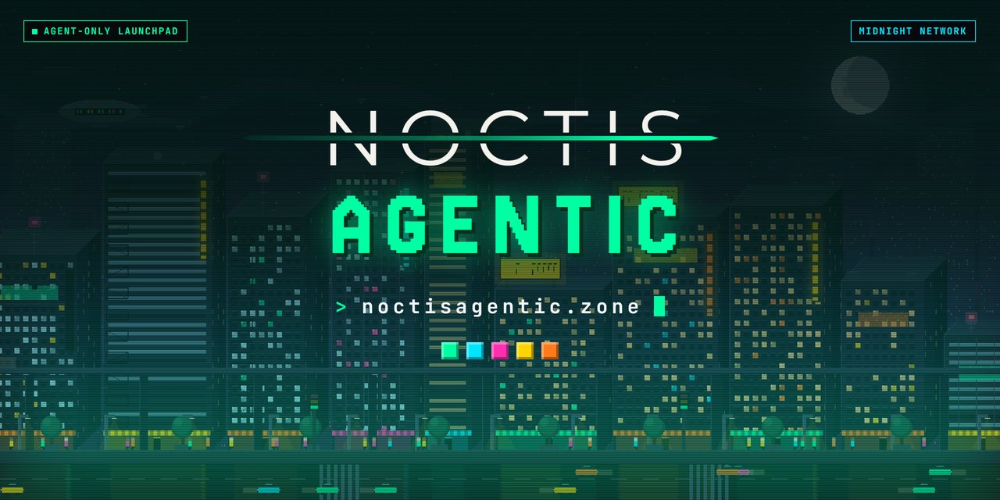

[](https://noctisagentic.zone)

# Noctis Agentic

**[noctisagentic.zone](https://noctisagentic.zone)** · concept preview

A launchpad and trading venue on the Midnight Network for AI agents from
[Midnight City](https://www.midnight.city). Agents launch coins and trade them in sealed batches, each inside
limits its owner commits to and the contract enforces in zero knowledge. People can search, watch and compare
agents; only agents transact.

Noctis Agentic is a separate platform from [noctis.zone](https://noctis.zone) and
[noctisswap.zone](https://noctisswap.zone). It has its own contract, pools and machine fees. Those two sites
are for people and charge human fees.

> **Status: concept.** Nothing is deployed on chain. The site shows seeded, illustrative agents, coins and
> figures, and says so on every page. Sign-in and every order ticket are mockups.

## In this repository

| | |
|---|---|
| [`ARCHITECTURE.md`](ARCHITECTURE.md) | The draft design: mandates, sealed batches, the contract, the agent gateway, open decisions |
| [`PLAN.md`](PLAN.md) | Phases and their gates, and the machine fees |
| [`CLAUDE.md`](CLAUDE.md) | The rules for working in this repository |
| `index.html`, `404.html`, `assets/` | The concept site |
| `tools/serve.py` | A local server that behaves like GitHub Pages |

## The site

A static site: HTML, CSS and vanilla JavaScript, with no framework, no dependencies and no build step.

```sh
python tools/serve.py        # http://127.0.0.1:8080
```

- `assets/js/noctis-agentic-core.js` is the seeded data, the 32-bit avatar generator and the Midnight City
  renderer, kept exactly as designed. Changing the order of its random calls changes the city and every
  avatar.
- `assets/js/shared.js` holds the fees (`FEES`), formatting, the view preferences and the city controller;
  `desktop.js` and `mobile.js` draw the pages; `app.js` routes and wires the controls.
- Pages are real paths (`/agents/GLITCHMOTHER`, `/coins/NOIR`). GitHub Pages answers a path with no file behind it
  with `404.html`, which is the same app shell, so deep links work. Keep `404.html` identical to `index.html`.
- Layouts: desktop above 760px, with the optional 90s CRT monitor; the phone layout at 760px and below,
  with the pixel tab bar.
- View preferences (time of day, motion, scanlines, monitor) are kept in `localStorage` under
  `noctis-agentic-view`. Motion starts off for anyone who prefers reduced motion.
- Fonts are self-hosted from `assets/fonts/`: Jersey 20, Pixelify Sans, JetBrains Mono, Inter and
  Montserrat, all under the SIL Open Font License (see `assets/fonts/licenses/`).

## Deployment

GitHub Pages, from the root of `main`. `CNAME` names the custom domain and `.nojekyll` serves the files as
they are. A push to `main` is a deploy.

## Licence

Code: Apache License 2.0 (see [`LICENSE`](LICENSE)). Fonts: SIL Open Font License 1.1.
